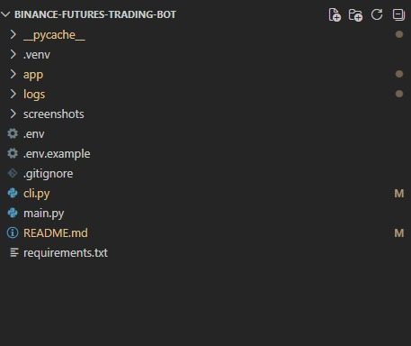
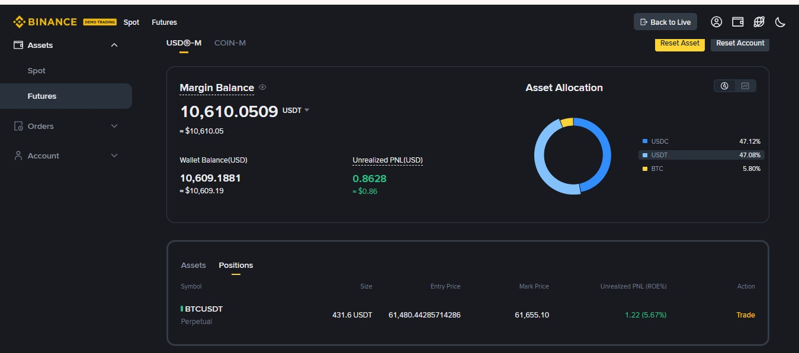
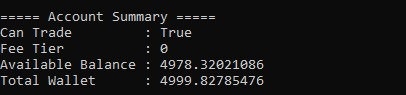
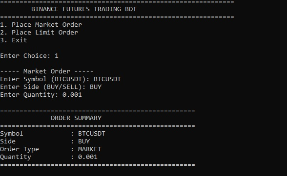
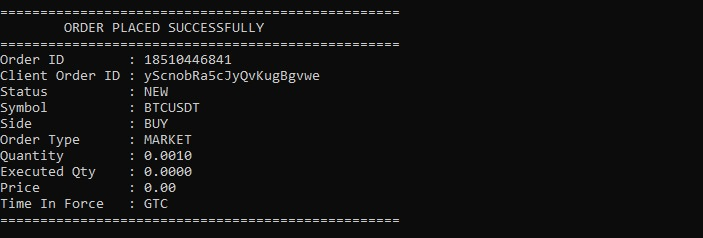
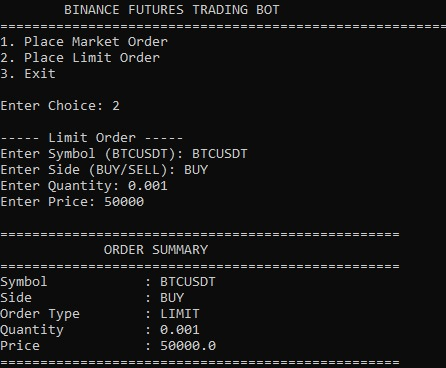
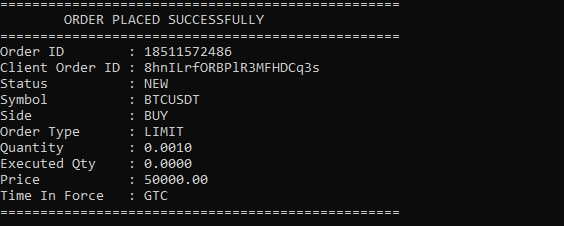
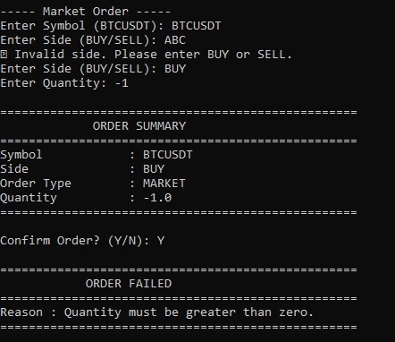

# Binance Futures Trading Bot (Testnet)

## Project Overview

The Binance Futures Trading Bot is a Python-based command-line application that interacts with the Binance Futures Testnet using authenticated REST APIs.

The application allows users to securely place MARKET and LIMIT orders through an interactive CLI while following a modular software architecture. It includes secure API authentication, HMAC SHA256 request signing, input validation, exception handling, configuration management, and comprehensive logging.

This project demonstrates professional backend development practices and real-world API integration using Python.

---

## Features

- Binance Futures Testnet Integration
- Secure API Authentication using API Key and Secret Key
- HMAC SHA256 Signature Generation
- Place MARKET Orders
- Place LIMIT Orders
- Interactive Command Line Interface (CLI)
- Input Validation
- Custom Exception Handling
- Professional Logging System
- Environment Variable Configuration
- Modular Layered Architecture
- Clean and Maintainable Code Structure

---

## Project Architecture

```
                    User
                      │
                      ▼
                  main.py
                      │
                      ▼
                   cli.py
                      │
                      ▼
                Order Service
                      │
                      ▼
                 client.py
                      │
                      ▼
          Binance Futures Testnet API
```

---

## Project Structure

```
Binance-Futures-Trading-Bot/
│
├── app/
│   ├── __init__.py
│   ├── client.py
│   ├── config.py
│   ├── constants.py
│   ├── exceptions.py
│   ├── logger.py
│   ├── orders.py
│   ├── utils.py
│   └── validators.py
│
├── logs/
│   └── trading.log
│
├── cli.py
├── main.py
├── .env.example
├── .gitignore
├── README.md
└── requirements.txt
```

---

## Technologies Used

| Technology | Purpose |
|------------|----------|
| Python 3 | Backend Development |
| Requests | REST API Communication |
| python-dotenv | Environment Variable Management |
| Logging | Request and Error Logging |
| HMAC SHA256 | Binance API Authentication |
| Binance Futures Testnet API | Futures Trading |
| Git | Version Control |
| VS Code | Development Environment |

---

## Installation

Clone the repository.

```bash
git clone https://github.com/your-username/Binance-Futures-Trading-Bot.git
```

Navigate to the project folder.

```bash
cd Binance-Futures-Trading-Bot
```

Create a virtual environment.

```bash
python -m venv .venv
```

Activate the virtual environment.

Windows

```bash
.venv\Scripts\activate
```

Install required packages.

```bash
pip install -r requirements.txt
```

---

## Configuration

Create a `.env` file in the project root.

```env
BINANCE_API_KEY=YOUR_API_KEY
BINANCE_SECRET_KEY=YOUR_SECRET_KEY
BASE_URL=https://testnet.binancefuture.com
```

**Note**

Never upload your `.env` file to GitHub.

---

## Running the Application

Run the application.

```bash
python main.py
```

---

## Application Workflow

```
Start Application

↓

Display Menu

↓

Select Order Type

↓

Enter Order Details

↓

Validate Input

↓

Display Order Summary

↓

Confirm Order

↓

Generate Signature

↓

Send Request to Binance

↓

Receive Response

↓

Display Result

↓

Return to Menu
```

---

## Order Types

### MARKET Order

Allows users to execute orders immediately at the current market price.

Required Inputs

- Symbol
- Side (BUY or SELL)
- Quantity

---

### LIMIT Order

Allows users to place an order at a specified price.

Required Inputs

- Symbol
- Side (BUY or SELL)
- Quantity
- Price

---

## Validation

The application validates user input before sending requests to Binance.

Validation includes

- Valid Symbol
- BUY or SELL Side
- MARKET or LIMIT Order Type
- Positive Quantity
- Positive Price
- Numeric Input Validation

---

## Logging

All API requests, responses, and errors are logged.

Example

```
REQUEST

Endpoint : POST /fapi/v1/order

Symbol : BTCUSDT

Side : BUY

Type : MARKET

Quantity : 0.001

--------------------------------

RESPONSE

Order ID : 18479272826

Status : NEW
```

The log file is stored in

```
logs/trading.log
```

---

## Exception Handling

The application includes custom exception handling for

- Invalid User Input
- Binance API Errors
- Missing Configuration
- Authentication Errors
- Network Errors

---

## Security

The application follows security best practices.

- API credentials stored in `.env`
- Secret Key never exposed
- `.env` excluded using `.gitignore`
- HMAC SHA256 request signing
- Secure REST API communication

---

## Screenshots

Add screenshots for the following sections.

### 1. Project Folder Structure





### 2. Binance Demo Trading Dashboard




### 3. Account Information



### 4. MARKET Order



### 5. Successful Market Order Response




### 6. LIMIT Order




### 7. Successful Limit Order Response




### 8. Validation Error




## Future Enhancements

Possible future improvements include

- Stop Loss Orders
- Take Profit Orders
- Open Orders Management
- Cancel Order Feature
- Position Monitoring
- Web Dashboard
- Docker Deployment
- Unit Testing
- CI/CD Pipeline

---

## Learning Outcomes

This project demonstrates knowledge of

- Python Programming
- REST API Integration
- Binance Futures API
- HMAC SHA256 Authentication
- Environment Variable Management
- Modular Software Design
- Exception Handling
- Logging
- Command Line Applications
- Clean Code Principles

---

## Author

Rajasekhar Kuruva

Python Backend Developer

GitHub:
https://github.com/rajasekharkuruva583-source

LinkedIn:
https://www.linkedin.com/in/rajasekhar-kuruva-ba94352aa

---

## License

This project is developed for educational purposes using the Binance Futures Testnet.